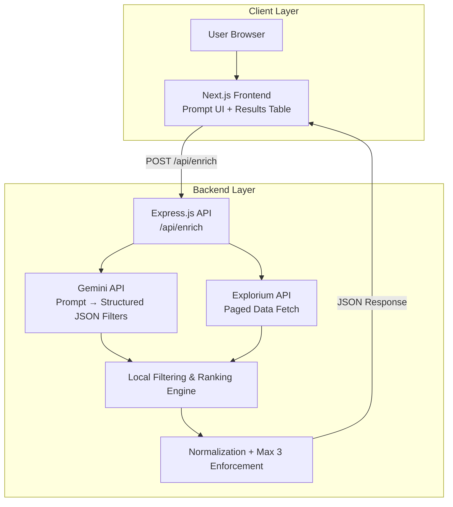

# OutMate – NLP Enrichment Demo

## Project Overview

OutMate is a production-style NLP → Filter → Enrichment pipeline designed to simplify B2B prospecting. The user enters a natural language query (e.g., "Find SaaS companies in New York with 50-200 employees"). The system then uses the Google Gemini API to parse this prompt and convert it into structured search filters.

These filters are securely passed to a high-throughput data provider (like Explorium) that fetches and enriches the matching B2B company or prospect entities. To simulate performance limits and a focused UI experience, a strict 3-record limit is enforced on all responses.

The entire application is built with production constraints in mind, featuring custom rate-limit handling, fallback parsers for AI network anomalies, error masking, and a clean, hierarchical SaaS frontend.

## Architecture

### High-Level System Architecture



The user submits a natural language query from the React frontend, which securely proxies an HTTP POST to the unified Express API. The backend immediately forwards the prompt to Google's Gemini API, functioning as a real-time NLP filter parser to convert conversational text into strict JSON criteria. The Express Server then asynchronously queries the enterprise data integration layer (Explorium) to retrieve a raw paginated database payload. This payload, along with the JSON criteria from Gemini, passes through a custom deterministic ranking service (`filterEngine.js`) where all semantic matching is applied cleanly inside the application bounds, ensuring optimal sorting. Finally, the sorted database payload passes through a defensive normalization layer that enforces a hard visual limit of 3 records before safely streaming the standard generic object back to the client interface.

The application is structured as a decoupled monorepo, separating a React-based frontend presentation layer from a Node/Express integration backend.

*   **Frontend**: A Next.js (React) application built for static exporting or simple server-less edge deployment. It handles user state, loading transitions, error parsing, and manages the hierarchical display of complex nested JSON data using Tailwind CSS.
*   **Backend**: An Express.js microservice layer responsible for securely proxying requests to external APIs. It maintains strict rate limits, centralizes error handling to prevent sensitive stack trace leaks, and runs the complex routing logic necessary to query Large Language Models.
*   **Data Layer**: A high-throughput data enrichment service (Explorium) designed to filter records based on multi-dimensional parameterized criteria.

## Tech Stack

*   **Frontend**: Next.js (React 18), Tailwind CSS, Lucide React (Icons)
*   **Backend**: Node.js, Express.js, Axios, Express-Rate-Limit, CORS, Dotenv
*   **AI Service**: Google Gemini API (`gemini-2.5-flash`)
*   **Data Service**: Enterprise Data Enrichment (Explorium/Clearbit logic)

## System Flow

1.  **Input**: The user submits a natural language prompt via the client UI.
2.  **Proxy**: The Next.js frontend sends an HTTP POST request to the Express backend (`/api/enrich`).
3.  **NLP Parsing**: The backend makes an API call to Google Gemini. Gemini evaluates the user's intent and returns a structured JSON object containing filter dimensions (e.g., `entity_type: "company"`, `employee_count_min: 50`).
4.  **AI Parsing**: If Gemini evaluates the prompt successfully, it returns a structured JSON object containing filter dimensions (e.g., `entity_type: "company"`, `employee_count_min: 50`).
5.  **Data Extraction**: The `exploriumService` fetches a paginated global dataset of raw entities.
6.  **Deterministic Filtering**: A local `filterEngine` service acts on the raw dataset, applying heuristic matching and relevancy ranking based on Gemini's exact output constraints.
7.  **Normalization & Truncation**: Raw data from the enrichment database is passed through `normalizeService` and strictly truncated to the top 3 highest-ranking records to guarantee a consistent interface contract.
8.  **Response**: Output is returned via JSON, and rendered by the frontend into structured cards.

## API Contract

**Endpoint**: `POST /api/enrich`

Accepts a natural language query and returns enriched B2B data. **Note: A strict limit of 3 maximum records is enforced on all success responses.**

**Request Body:**
```json
{
  "prompt": "Find SaaS companies in the US with 50-500 employees"
}
```

**Success Response (200 OK):**
```json
{
  "results": [ // Maximum 3 items returned
    {
      "type": "company",
      "name": "Outmate.ai",
      "domain": "outmate.ai",
      "industry": "Artificial Intelligence",
      "revenue": "$1M - $5M",
      "employee_count": 50,
      "country": "US",
      "linkedin_url": "https://linkedin.com/company/outmate-ai",
      "founded_year": 2023,
      "tech_stack": ["Next.js", "Node.js", "React"],
      "phone": "+1-415-555-1234",
      "key_contacts": [{"name": "Yash Sharma", "title": "Founder"}],
      "raw": { /* ... raw provider payload ... */ }
    }
  ]
}
```

**Error Response (500 Internal Server Error):**
```json
{
  "error": "AI service temporarily unavailable. Please try again later."
}
```

## Environment Variables

For the backend to function securely, all secrets are stored in a `.env` file and are **never** committed into the repository. 

Create a `.env` file in the `/backend` directory with the following variables:

```env
# Server Configuration
PORT=5000
FRONTEND_URL=http://localhost:3000

# Google Gemini (NLP Parsing)
GEMINI_API_KEY=your_google_studio_api_key_here

# Explorium (Data Enrichment API)
EXPLORIUM_API_KEY=your_explorium_api_key_here
```

## Local Setup

**1. Clone Repo**
```bash
git clone https://github.com/your-username/outmate-nlp-demo.git
cd outmate-nlp-demo
```

**2. Install Dependencies**
```bash
# Install backend dependencies
cd backend
npm install

# Install frontend dependencies
cd ../frontend
npm install
```

**3. Create .env File**
Navigate to the `backend` folder and create a `.env` file based on the environment variables defined above:
```bash
cd ../backend
touch .env
```
*(Add your `GEMINI_API_KEY` and `EXPLORIUM_API_KEY` inside this file)*

**4. Start Backend**
From the `backend` folder, start the API server:
```bash
npm run dev
# Runs on http://localhost:5000
```

**5. Start Frontend**
Open a new terminal window, navigate to the `frontend` folder, and start the Next.js app:
```bash
cd frontend
npm run dev
# Runs on http://localhost:3000
```

## Deployment

*   **Backend**: Designed to be deployed as a standalone Node environment on Render, Heroku, or AWS Elastic Beanstalk. Ensure `PORT` is bound dynamically by the host and CORS origins are strictly defined.
*   **Frontend**: Designed to be deployed on Vercel or Netlify.

## Example Requests & Responses

**Prompt:** *"Top AI companies hiring in Canada"*
**Gemini Translation:**
```json
{
  "entity_type": "company",
  "filters": {
    "industry": ["AI", "Artificial Intelligence"],
    "countries": ["Canada"]
  }
}
```

**Prompt:** *"Give me VP Sales in Germany fintech startups"*
**Gemini Translation:**
```json
{
  "entity_type": "prospect",
  "filters": {
    "industry": ["fintech"],
    "countries": ["Germany"],
    "job_titles": ["VP Sales", "Vice President of Sales"]
  }
}
```

## Design Decisions

1.  **Defensive Record Limitation (Max 3)**: A strict 3-record limit is enforced at the backend level. This prevents downstream cascading failures, mitigates UI rendering latency for massive arrays, and acts as a hard stop against accidental API payload bloat during the enrichment phase.
2.  **Normalization Layer Isolation**: A strict mapping layer sits between the `exploriumService` and the `/api/enrich` controller. This decouples the React frontend from the volatile schema of third-party data providers. If the provider's API structure changes, only the backend mapping needs updating, leaving the client contract intact.
3.  **Proactive Rate Limiting**: The Express middleware injects IP-based rate limiting on the `/api/enrich` route. This is a critical defense against distributed denial-of-service (DDoS) attacks and prevents malicious or runaway client scripts from exhausting the underlying LLM quotas and racking up API costs.
4.  **Enforced JSON Constraints**: The Gemini prompt is engineered to demand absolute, raw JSON output without markdown wrapper formatting. This guarantees that the Node.js `JSON.parse()` pipeline executes predictably, preventing LLM conversational hallucination from crashing the endpoint logic.
5.  **Mandatory Environment Variables**: All API keys, secrets, and environment-specific endpoints (like `PORT` and `FRONTEND_URL`) are strictly isolated behind `.env` files. This ensures that sensitive credentials are never committed to version control and allows for seamless CI/CD staging transitions.
6.  **Production Validation**: The enrichment layer was validated against live Explorium endpoints (`response.data.data`). Because those specific `/v1/businesses` endpoints natively act as global fetchers without inline schema querying, filters are applied deterministically within the local backend service layer (`filterEngine`) against the enriched dataset results retrieved from Explorium.

## Limitations & Future Improvements

1.  **External API Dependency**: The system relies heavily on third-party APIs (Google Gemini and Explorium). Network latency, upstream outages, or API quota exhaustion directly impact enrichment capabilities.
2.  **Strict Cap Limits**: While defensive, the strict 3-record cap natively restricts expansive dataset exploration and bulk prospecting use cases without pagination.
3.  **Language Restraints**: The prompt parser and filter logic are currently optimized to process and construct query criteria exclusively from English language inputs.
4.  **Ranking Algorithms**: Advanced heuristic scoring or nuanced relevance ranking of enriched results is not yet implemented natively in the normalization layer.
5.  **Caching Strategy**: Currently, there is no Redis or distributed caching layer implemented to serve duplicate queries, meaning identical prompts will redundantly consume upstream LLM tokens.
